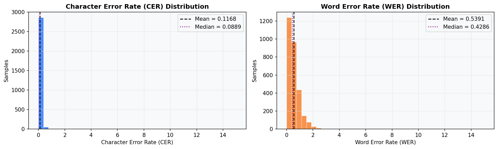
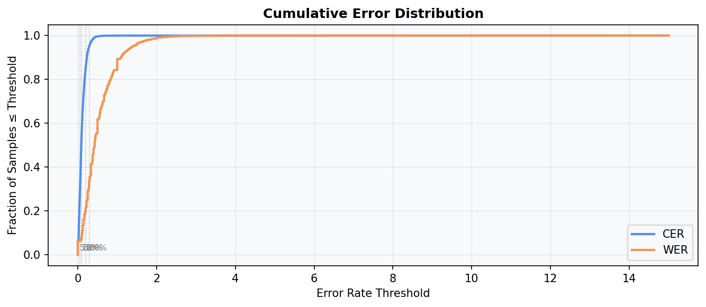
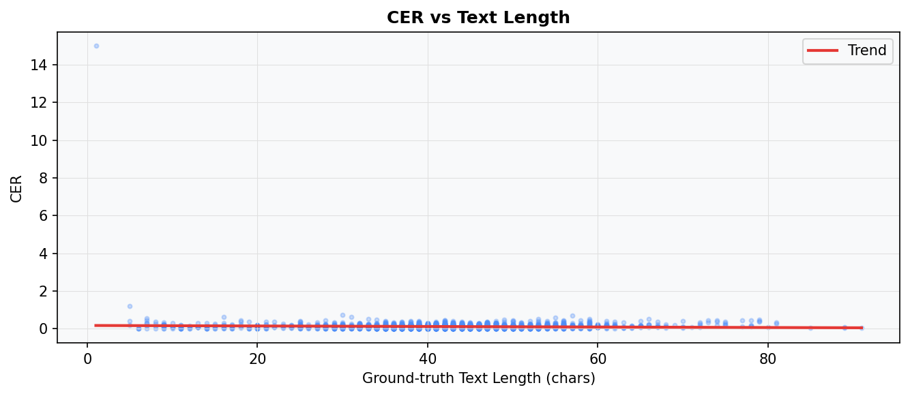
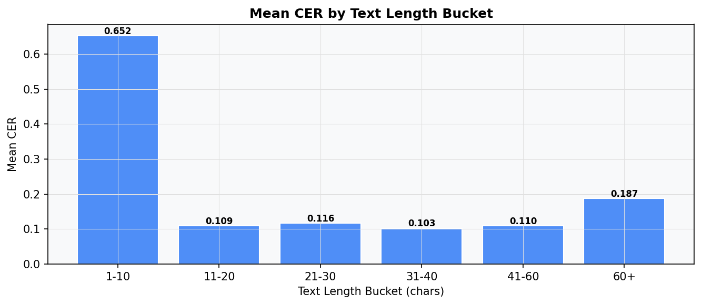
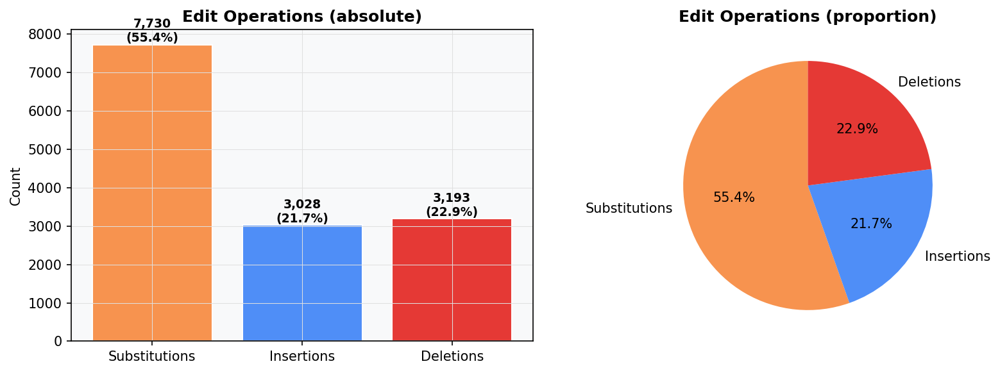
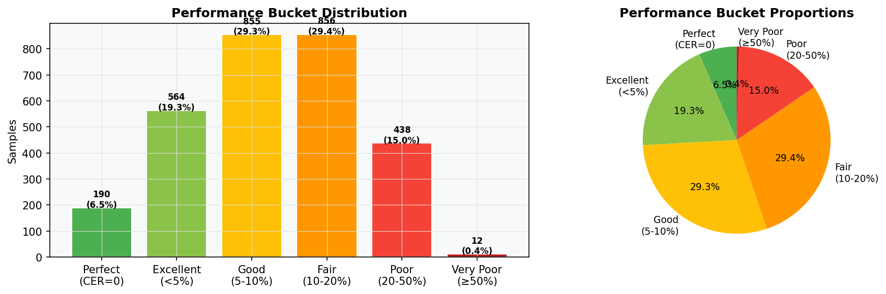
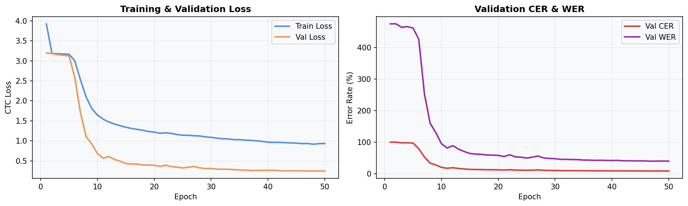

# HTR Model — Test Report
> Generated: 2026-04-23 19:02:33  |  Model: **CRNN_V2**  |  Checkpoint: `checkpoints/best_model_v2.pth`
---

## 1. Model Information
| Field | Value |
|---|---|
| Architecture | CRNN_V2 |
| Checkpoint | `checkpoints/best_model_v2.pth` |
| Saved at epoch | 47 |
| Val CER (training) | 8.34% |
| Vocab size | 79 chars |
| Training log | `training_log_v2.csv` |

## 2. Test Dataset Overview
| Field | Value |
|---|---|
| Total test samples | 2,915 |
| Mean text length (chars) | 42.3 |
| Min / Max length | 1 / 91 |
| Mean word count | 8.9 |

## 3. Overall Performance
| Metric | Value |
|---|---|
| **Mean CER** | **11.68%** |
| Median CER | 8.89% |
| Std CER | 29.08% |
| Min CER | 0.00% |
| Max CER | 1500.00% |
| **Mean WER** | **53.91%** |
| Median WER | 42.86% |
| Exact Match Rate | 6.52% (190/2,915) |
| Char Accuracy (1-CER) | 88.32% |
| Word Accuracy (1-WER) | 46.09% |

## 4. Performance Buckets
| Bucket | Count | Percentage |
|---|---:|---:|

| Perfect (CER=0) | 190 | 6.5% |
| Excellent (<5%) | 564 | 19.3% |
| Good (5–10%) | 855 | 29.3% |
| Fair (10–20%) | 856 | 29.4% |
| Poor (20–50%) | 438 | 15.0% |
| Very Poor (≥50%) | 12 | 0.4% |

## 5. Charts

### CER & WER Distributions

### Cumulative Error Distribution

### CER vs Text Length

### Mean CER by Length Bucket

### Edit Operations Breakdown

### Performance Bucket Distribution

### Training History

## 6. Edit Operations Analysis
| Operation | Count | Proportion |
|---|---:|---:|
| Substitutions (wrong char) | 7,730 | 55.4% |
| Insertions (extra char) | 3,028 | 21.7% |
| Deletions (missing char) | 3,193 | 22.9% |
| **Total errors** | **13,951** | 100% |

## 7. Best Predictions (lowest CER)

| # | Ground Truth | Prediction | CER | WER |
|---|---|---|---:|---:|
| 1 | `The film covered a wide aspect of the British` | `The film covered a wide aspect of the British` | 0.0% | 0.0% |
| 2 | `to make the strongest criticisms . He said` | `to make the strongest criticisms . He said` | 0.0% | 0.0% |
| 3 | `and who is now being pluckily convivial` | `and who is now being pluckily convivial` | 0.0% | 0.0% |
| 4 | `showing that such changes are part of a` | `showing that such changes are part of a` | 0.0% | 0.0% |
| 5 | `text of the Gospel .` | `text of the Gospel .` | 0.0% | 0.0% |
| 6 | `text with absolute precision .` | `text with absolute precision .` | 0.0% | 0.0% |
| 7 | `reference .` | `reference .` | 0.0% | 0.0% |
| 8 | `which have survived the centuries is ample evidence of` | `which have survived the centuries is ample evidence of` | 0.0% | 0.0% |
| 9 | `This last objection might have had some weight in` | `This last objection might have had some weight in` | 0.0% | 0.0% |
| 10 | `sending out his Gospel lacking the ending ,` | `sending out his Gospel lacking the ending ,` | 0.0% | 0.0% |

## 8. Mid-range Sample Predictions

| # | Ground Truth | Prediction | CER | WER |
|---|---|---|---:|---:|
| 1 | `to face their fears , to se through them and come out on the` | `to face thir fer , to vee thrugh them and cone out on the` | 11.7% | 50.0% |
| 2 | `I don't think he wil storm the charts with this one , but it…` | `I dont thinn he will slorm the charks with this one , bal it…` | 11.7% | 47.4% |
| 3 | `made this century is the way in which ilnes` | `made this century is the wary in which illaio` | 11.6% | 55.6% |
| 4 | `Comite met once a wek in the evenings , and` | `Committee met once a wek in the evenings and` | 11.6% | 50.0% |
| 5 | `plenty of time together in the future . And` | `Panty of time togethen in the futue . And` | 11.6% | 55.6% |
| 6 | `research at first hand into maters on which` | `reseauch at fist haud into mattlers on which` | 11.6% | 62.5% |
| 7 | `' Something 's up , ' said Lord Undertone ,` | `" Something's up " said Lord Undertone ,` | 11.6% | 50.0% |
| 8 | `For the time being Beryl was content to let` | `for the time being bey) was contet to let` | 11.6% | 55.6% |
| 9 | `3" He powerful anxious , por Mistah Piers .` | `SlHe powerful ancious , pour Mistah Piers .` | 11.6% | 55.6% |
| 10 | `weather side of that pier ! He 'l wreck ! "` | `weather side of that pier ! He ll crecke ! " "` | 11.6% | 45.5% |

## 9. Worst Predictions (highest CER)

| # | Ground Truth | Prediction | CER | WER |
|---|---|---|---:|---:|
| 1 | `-` | `envence alabase` | 1500.0% | 1500.0% |
| 2 | `wep .` | `wveen .. .` | 120.0% | 300.0% |
| 3 | `him sudenly , making him say :` | `"fyionsudidenley pacdingtintions .` | 73.3% | 314.3% |
| 4 | `Junior Medical Oficer . " You won't be fre about nine , I` | ` Pauirce masicne oxercen . " Jon WaN'T EE FaEE ABONT NNE , '` | 68.4% | 292.3% |
| 5 | `asked hopefuly .` | `Asar Moriiny .` | 62.5% | 333.3% |
| 6 | `became great sighs of ecstacy .` | `becane acahtalsatecsan` | 61.3% | 316.7% |
| 7 | `expres their disgust at Sir John's abominable treatment` | `yo thir diget t he h s hoihe eadoud` | 58.2% | 400.0% |
| 8 | `miles .` | `unter .` | 57.1% | 200.0% |
| 9 | `which ' lark ' she would have to stop , only that significan…` | `wah tht the wald hart o iop ,aly that pepoentey` | 53.0% | 250.0% |
| 10 | `he shruged difidently , " I like the work . One gets plenty` | `HE smewe dioarrw , a I lipE THE wopn . one Grs prowto` | 52.5% | 238.5% |

## 10. Observations
### Strengths
- Model achieves **11.68% mean CER** on the IAM test split.
- **6.5%** of samples are transcribed perfectly.
- **25.9%** of samples have CER < 5%.
- Character substitutions dominate errors — the model reads the right number of characters but confuses similar-looking glyphs.

### Weaknesses & Domain Gap
- Performance degrades on **real-world camera photos** (different lighting, ink color, perspective).
- The model was trained on clean IAM scanner images — it has not seen blue ink, paper texture, or camera noise during training.
- Longer lines (>40 chars) tend to have higher CER due to accumulated LSTM errors.

## 11. Recommendations to Improve Generalization

| Priority | Technique | Expected Gain |
|---|---|---|
| 🔴 High | **Test-Time Augmentation (TTA)** — run inference with 3 CLAHE params, pick highest confidence | ~1–2% CER |
| 🔴 High | **Beam Search CTC decoding** (beam=10) instead of greedy | ~1–3% CER |
| 🟡 Med  | **Domain-adaptive augmentation** — simulate camera photos (RandomPerspective + ColorJitter) during training (already added in V2) | ~2–4% CER |
| 🟡 Med  | **Fine-tune on small real-world labeled set** — even 100 labeled camera photos boosts real-world accuracy dramatically | ~10–20% on photos |
| 🟢 Low  | **Character-level language model** (4-gram) for CTC rescoring | ~1–2% CER |
| 🟢 Low  | **Larger training data** — IAM + RIMES + CVL datasets combined | ~3–5% CER |
| 🟢 Low  | **Attention mechanism** in addition to CTC | ~2–4% CER |

---
*Report generated by `test.py` on 2026-04-23 19:02*
